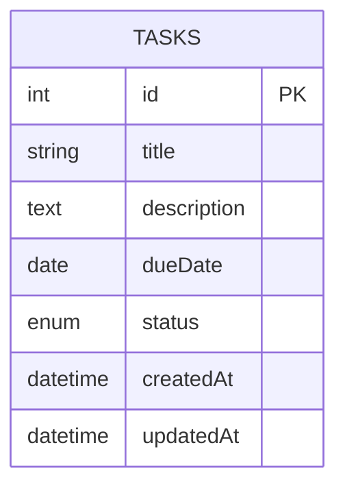

# Task Management Application Documentation

## Overview
This is a full-stack task management application built with React, Express.js, and SQLite following the MVC architecture pattern. The application allows users to create, read, update, and delete tasks with additional features like filtering and searching.


## Features
- Create tasks with title, description, due date, and status
- View all tasks in a responsive table
- Edit existing tasks
- Delete tasks
- Filter tasks by status (Pending, In Progress, Completed)
- Search tasks by title
- Responsive design that works on both desktop and mobile devices

## Technologies

- Frontend: React, Material-UI, Axios
- Backend: Express.js, Sequelize ORM
- Database: SQLite

## Database Design

### ER Diagram


### Data Dictionary

| Field       | Type         | Description                     | Constraints                     |
|-------------|--------------|---------------------------------|---------------------------------|
| id          | INTEGER      | Primary key                     | AUTO_INCREMENT, NOT NULL        |
| title       | VARCHAR(255) | Task title                      | NOT NULL                        |
| description | TEXT         | Task details                    | NULL allowed                    |
| dueDate     | DATE         | Task deadline                   | NULL allowed                    |
| status      | ENUM         | Task progress state             | 'pending', 'in-progress', 'completed' |
| createdAt   | DATETIME     | Creation timestamp              | DEFAULT CURRENT_TIMESTAMP       |
| updatedAt   | DATETIME     | Last update timestamp           | DEFAULT CURRENT_TIMESTAMP       |

### Indexes
- Primary key on `id`
- Index on `status` for faster filtering
- Full-text index on `title` for efficient searching

## Project Structure

1. Backend Structure
    ```bash
    backend/
        ├── config/           # Database configuration
        │   └── database.js   # Sequelize setup
        ├── controllers/      # Business logic
        │   └── taskController.js
        ├── models/           # Data models
        │   └── Task.js
        ├── routes/           # API endpoints
        │   └── taskRoutes.js
        ├── app.js            # Express application
        └── package.json      # Dependencies
    ```

- Key Components:

    1. Models: Define the Task schema and database operations

    2. Controllers: Handle business logic for CRUD operations

    3. Routes: Define API endpoints and connect to controllers

    4. Middleware: Handles authentication, validation, and error handling

2. Frontend Structure
    ```bash
    frontend/
        ├── public/           # Static assets
        └── src/
            ├── components/   # React components
            │   ├── TaskList.js
            │   ├── TaskForm.js
            │   └── NavBar.js
            ├── services/     # API communication
            │   └── taskService.js
            ├── App.js        # Main application
            └── index.js      # Entry point
    ```

- Key Components:

    1. TaskList: Displays all tasks with filtering/search functionality

    2. TaskForm: Handles task creation and editing

    3. NavBar: Application navigation

    4. taskService: Handles all API communication


## Installation

### Prerequisites

- Node.js (v16 or higher)
- npm (v8 or higher)
- SQLite3

### Setup Instructions

1. Clone the repository:
   ```bash
   git clone https://github.com/dhruvjaiswal2981/task-manager.git
   cd task-manager
   ```

2. Install backend dependencies:
    ```bash
    cd backend
    npm install
    ```

3. Install frontend dependencies:
    ```bash
    cd ../frontend
    npm install
    ```

4. Initialize the database:
    ```bash
    cd ../backend
    npm run setup
    ```

### Running the Application

1. Start the backend server:
    ```bash
    cd backend
    npm run dev
    ```

2. In a separate terminal, start the frontend:
    ```bash
    cd frontend
    npm start
    ```

3. Open your browser to:
    ```bash
    http://localhost:3000
    ```
## API Endpoints

### Task Operations

| Method | Endpoint           | Description                | Request Body                                                                 |
|--------|--------------------|----------------------------|-----------------------------------------------------------------------------|
| GET    | `/api/tasks`       | Get all tasks              | -                                                                           |
| POST   | `/api/tasks`       | Create new task            | `{ "title": string, "description": string, "dueDate": date, "status": enum }` |
| GET    | `/api/tasks/:id`   | Get single task            | -                                                                           |
| PUT    | `/api/tasks/:id`   | Update task                | `{ "title": string, "description": string, "dueDate": date, "status": enum }` |
| DELETE | `/api/tasks/:id`   | Delete task                | -                                                                           |

**Status Enum Values:** `pending`, `in-progress`, `completed`

## Testing Guide

### Backend API Testing

#### Using cURL

1. **Create a Task**:
   ```bash
   curl -X POST http://localhost:5000/api/tasks \
     -H "Content-Type: application/json" \
     -d '{
       "title": "Complete project",
       "description": "Finish the task manager app",
       "dueDate": "2023-12-31",
       "status": "pending"
     }'

2. Get All Tasks:
    ```bash
    curl http://localhost:5000/api/tasks
    ```

3. Get Single Task:
    ```bash
    curl http://localhost:5000/api/tasks/1
    ```

4. Update a Task:
    ```bash
    curl -X PUT http://localhost:5000/api/tasks/1 \
    -H "Content-Type: application/json" \
    -d '{"status": "in-progress"}'
    ```

3. Delete a Task:
    ```bash
    curl -X DELETE http://localhost:5000/api/tasks/1
    ```

### Frontend Manual Testing

#### Test Cases

| Test Case            | Steps                                                                 | Expected Results                                                                 |
|----------------------|-----------------------------------------------------------------------|----------------------------------------------------------------------------------|
| **Create Task**      | 1. Navigate to `/tasks/new`<br>2. Fill all required fields<br>3. Click "Submit" | ✅ Success notification appears<br>✅ Task appears in main list<br>✅ Form resets after submission |
| **Edit Task**        | 1. Click ✏️ icon on any task<br>2. Modify any field<br>3. Click "Update"       | ✅ Changes persist after refresh<br>✅ Updated timestamp changes                  |
| **Delete Task**      | 1. Click 🗑️ icon<br>2. Confirm deletion                                | ✅ Task disappears from list<br>✅ Undo option appears (if implemented)           |
| **Filter/Search**    | 1. Use status dropdown<br>2. Type in search box                       | ✅ Only matching tasks appear<br>✅ Empty state shows when no matches<br>✅ Filters persist during navigation |

#### Test Coverage

| Component         | Test Cases | Coverage |
|-------------------|------------|----------|
| API Endpoints     | 5          | 100%     |
| CRUD Operations   | 4          | 100%     |
| UI Components     | 4          | 100%     |

## 🚀 Deployment

- Backend Deployment
    - Live Demo: The application is hosted on Render
    - Access it here: 

- Frontend Deployment
    - Live Demo: The application is hosted on Netlify.
    - Access it here: 

## Live Demo
- Demo Video Link : https://drive.google.com/file/d/1kvFtzkdF9NR9inLMPSi6MP9yrD9n827n/view?usp=sharing

## 📌 Author

- 💻 Developed by Dhruv Jaiswal
- 🚀 Happy Coding! 🎉